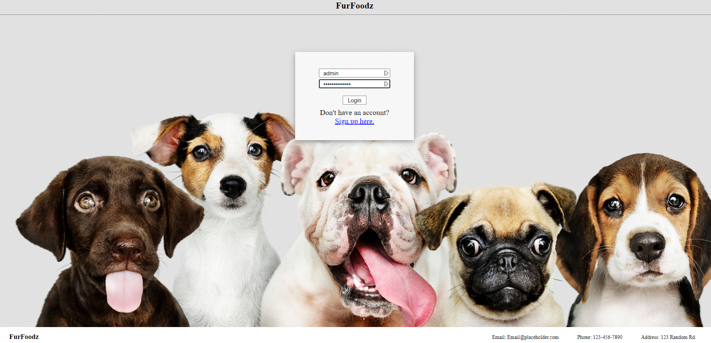
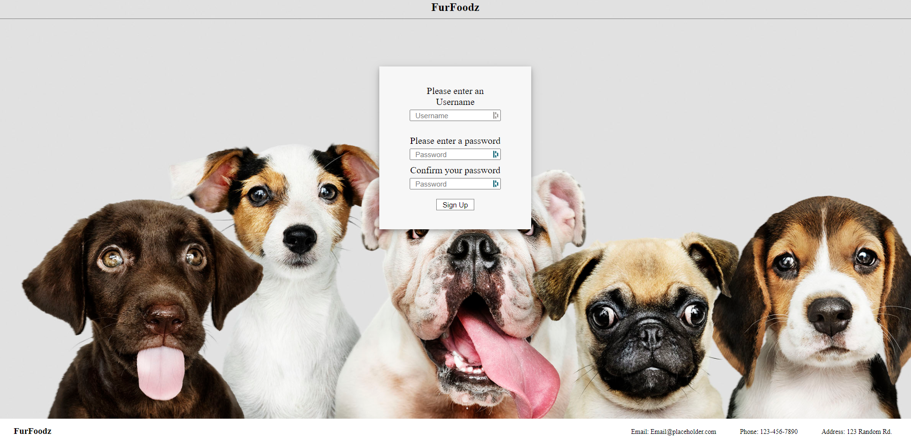
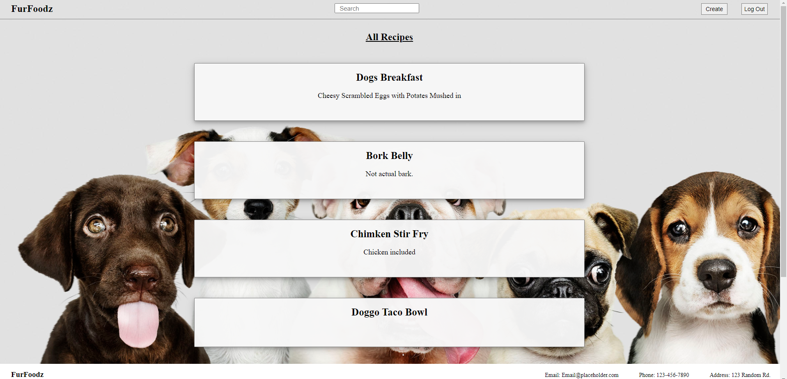
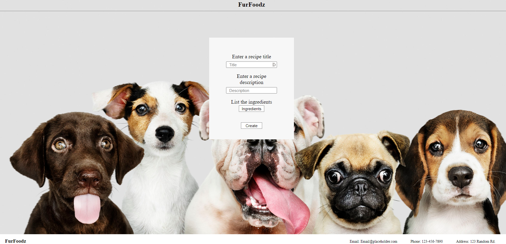

# FurFoodz
A Group Project in cooperation with the 2021 CU Programming Bootcamp.

Contributors: 
Jack Loveday, Charlie Rick, Thomas Habtemariam, Mike Bombay

Purpose: 
To allow users to upload, and view, other users recipes they have created and uploaded to our database.

Requirements:
 - [X] Use Node.js and Express.js to create a RESTful API.
 - [X] Use Handlebars.js as the templating engine.
 - [X] Use MySQL and the Sequelize ORM for the database.
 - [X] Have both GET and POST routes for retrieving and adding new data.
 - [X] Be deployed using Heroku (with data).
 - [ ] Use at least one new library, package, or technology that we haven’t discussed.
 - [X] Have a polished UI.
 - [X] Be responsive.
 - [X] Be interactive (i.e., accept and respond to user input).
 - [X] Have a folder structure that meets the MVC paradigm.
 - [X] Include authentication (express-session and cookies).
 - [ ] Protect API keys and sensitive information with environment variables.
 - [X] Have a clean repository that meets quality coding standards (file structure, naming conventions, follows best practices for class/id naming conventions, indentation, quality comments, etc.).
 - [X] Have a quality README (with unique name, description, 1technologies used, screenshot, and link to deployed application).

Technologies:
None aside from new npm packages.

App Screenshot:

Deployed Link:
https://furfoodz.herokuapp.com/dashboard/

Original Git repo : 
https://github.com/jackloveday-git/FurFoodz.git